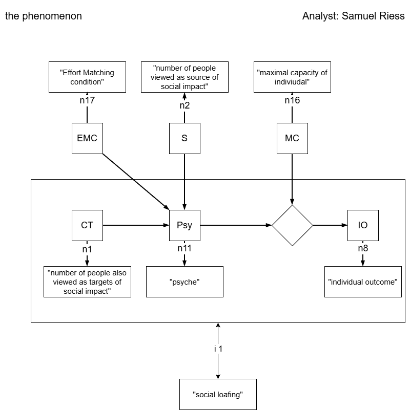
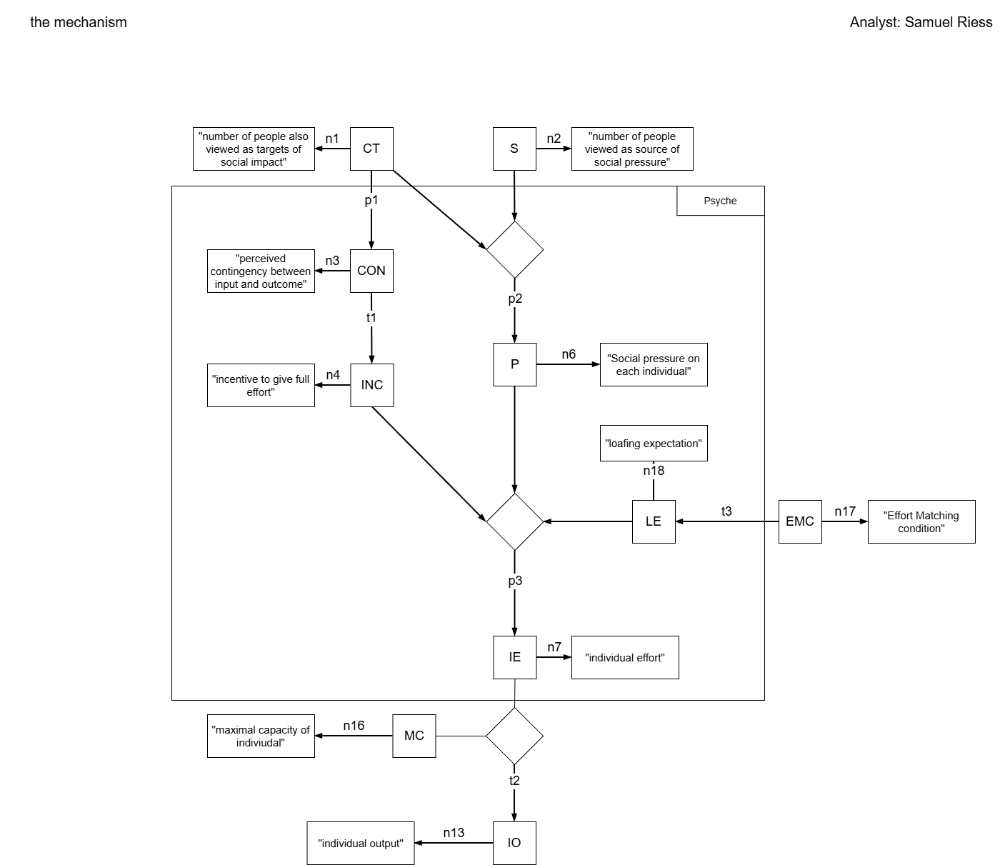

```{r setup}
#| echo: false 
#| include: false 

# loading of the necessary packages 
library(papaja) # for an automatically output of results, p.e. apa_print()
library(flextable) # for displaying tables in APA-Style 
library(pwr) # for the power-Analysis 
library(ggplot2) # for the plotting and descriptives
library(dplyr) # for smoother functions
library(multcomp) # for the statistical analyses

#if we source a R-document, it runs in advance and we get all created objects from that file aswell for that document/report
source("simulation/01_base.R")
source("simulation/02_simulation.R")
```

# Objective

In this report, we formalize an existing psychological theory to test the relation between the emerging phenomena and the corresponding data by means of a computational model, based on the underlying theory. Following the methodological framework outlined by Borsboom [@borsboom2021], we generate simulated data for a fictional experiment inspired by the original study in which the phenomenon was first described. We are mainly interested in replicating key empirical findings associated with the phenomenon and to demonstrate that the model is capable of reproducing the phenomenon across different hypothetical scenarios. The need for such work is grounded in broader concerns within psychological science, known under terms like "reproducibility crisis" (citation Borsboom). Hence, our aim is to take a closer look at the relationship between the underlying theory and the emerging phenomenon, evaluating how well the theoretical assumptions can account for the observed effects.

# Introduction of the theory

We selected our social psychology theory because it provides a framework of clearly operationalized variables, allowing a precise measurement for input factors and their resulting phenomenon. The theory, named "social impact theory", was first mentioned in 1973, but the large framework with all assumed mechanisms and effects was published 8 years later [@latané1981]. Between these publications, and chosen for our central phenomenon emerging from social impact, Latané published "Many Hands Make Light The Work: The Causes and Consequences of Social Loafing" in which the term "social loafing" was first defined. There, they tried to explain it using the first approaches of this theory. For adding more depth to the phenomenon we are referring to an extending mechanism, named "Effort Matching" [@jackson1985].

## Core constructs

Our formalization is grounded on some core constructs. These are orientated at quotes we withdrawed directly from the existing research. Some constructs were specified differently over the whole report, so we aimed to label them in a way that serves a greater interpretation. Of course, these labels are our own understanding of the constructs, further researchers may focus on other elements. Furthermore, the scope is strongly limited to the main social loafing research, we only differ if a special need or cause occurred. The central social impact theory contains more than our chosen phenomenon so we were able to further limit the scope.

All constructs and their sources can be seen in (Table 1), our presented VAST model in @fig-mechanism contains them in a connected and graphic way to understand the underlying mechanism of the phenomenon. As one can see, the initial constructs that cause the effect are the Co-Targets (CT) and Sources (S) of social impact, which represent group members and e.g. experimenters who supervise the whole group in an experiment. Of course, the sources can be every kind of person that performs pressure or impact on a certain group or individual. On this note, it is worth mentioning that pressure and impact are not further separated so we're sticking with the definition "pressure" in this report, resulting in our construct P. The contingency between input and outcome (CON) marks a prior expectation, not an objective fact. That's why its presented as part of the "Psy"-Box. It leads later on to the "incentive to work equally hard" (INC), linked with a proportional relationship [@latané1979]. Their values are the same, whilst INC contains a more motivational nature. The final psychological output of the mechanism is the individual effort (IE) which is the cause for the manifest output later on. The constructs "effort matching condition" (EMC) and "loafing expectation" consist both of three conditions, marking the 3 conditions of Effort matching we I implemented in the research from another source[@jackson1985]. We didn't include constructs like "identifiability"" due to our strict replication and setting identifiability to "not given", based on the original experiments [@latané1979]. The same reason accounts for disregarding the constructs immediacy and strength of Source or Co-Targets.

## Identification of the relevant Phenomena

In [@latané1979], the resulting social loafing is described as followed: "People exhibit a sizeable decrease in individual effort when performing in groups as compared to when they perform alone". The Effort Matching mechanism which underlies this phenomenon is defined in another research, stating: "they will maintain equity by matching the effort levels they expect from their partners" [@jackson1985]. This was already discussed before [@latané1979] but further investigated in the newer report. The idea is that social loafing can be eliminated if the expectation to loaf, drawn to the effort of other group members, is capable of eliminating the central social loafing mechanism.

To create a link between this phenomenon and our formalization of the social impact theory, we used our visual tool once more. The resulting phenomenon itself can be seen in @fig-vast.

{#fig-vast fig-align="center" width="80%"}

To address the robustness of social loafing and therefore the very reason for investigating it further, we part it into two sections: Strenth of evidenve and generalizability, using the UTOS framework. We get our overview for both by analyzing a Meta-Analysis concerning social loafing [@karau1993] which conducts about 78 studies of the topic. We found quotes like "using a range of subject populations varying in age, gender, and culture. This leads to a variation of Units (u). The variation of treatment (T) is supported by using different attributes of the task itself, e.g. complexity, type of effort, quantity or quality. Within- and between-subjects comparisons across coactive and collective conditions took place in investigating social loafing. the variation of Outcomes (O) is supported by operationalizing the dependent variable through cognitive of physical effort. sometimes, it was based on an individual or group level. Finally, the (S) of the experiments took place in different coutries, what we interpreted as a generalization over different cultures and a confirmation of the last UTOS-dimension. The strength of evidence can be acknowledged with mean effect sizes that "differed significantly from the 0.00 value that indicates exactly no difference". The most pithy evidence can be found in the result section. Directly, the mean effect size was found to be d = .44 which was statistically significant (p \< .001), presenting a moderate effect according to Cohen's general conventions. Taken together, the phenomenon can be considered robust because the whole UTOS framework and the strength of evidence are supported with empirical data.

# Method

All documents used in the process of writing this report can be found and downloaded from the GitHub repository: https://github.com/SamRiess/SocialLoafing_FINAL.git This report refers to version number v1.0.0. See the .cff file for further information.

## used software

Throughout our formalization, we use the Visual Argument Structure Tool (VAST, [@leising2023]) to build a graphic visualization of the theory and resulting mechanisms. With this methodology, we are able to define relationships, our understanding of core constructs and the mechanisms that take place in the process of social loafing and effort matching. For the computation of our simulated Data, we used R(hier Versionsnummer einfügen). Our graphic representation of the formalized theory was enabled throughout the application draw.io in which we created our VAST model.

## Formalization of the (Proto-)Theory

We used the VAST (Visual Argument Structure Tool) as a graphic form of formalization for our theory. Further information about the VAST and its application can be found in @leising2023. In the process, it was crucial to limit our scope, referring to both theory and phenomenon. The main goal should be understandability, not the whole integrity of the full theory. We were limiting our scope to the following aspects: we set the identifiability of the individual effort to non-existent. This can be justified for that the identifiability wasn't part of the experiments for social loafing [@latané1979], neither was it for effort matching [@jackson1985]. Further, we ignore the mentioned multiplicative connection between immediacy, strength and number of Co-Targets or Sources [@latané1981]. These weren't, again, part of previous research so we didn't focus on that specific part of social impact theory. A few more additional assumptions were crucial for our finalized theory and model to work. Other mentioned constructs like the default expectation for other peoples loafing wasn't specifically evaluated and included. We ought to deal with this in using the mechanism in the Psy box to generate this default expectation, tho it wasn't defined directly. With this approach, the underlying process gains more understandability while the high and low Effort condition could be included into the Superfunction for our psyche process without complicating the model itself. The extension of the maximum capacity was necessary for simulation purposes, it isn't mentioned in the theory itself either. Without implementing this construct, we weren't able to compute a manifest Variable cause the main output of the psychological process is just a percentage number which cannot be measured without a baseline which presents 100% of the possible effort. See Table 2 for further values. As we're introducing later in this report, these restrictions or extensions weren't loss-making for our Model and replication of the loafing effect and therefore providing a post-hoc evaluation. Our resulting prototype theory which ought to explain the phenomenon is presented in (@fig-mechanism). The "relationships" section shows each relationship and its justification, based on quotes from previous research (labeled with a "q" in Table 3) or our own assumptions or restrictions. In keeping this section short, I am mixing up the explanation of the model with its justification of the described relationships.

{#fig-mechanism fig-align="center" width="100%"}

### Variables

All our used variables for each of the constructs, if shown in our VAST, can be seen in (Tabelle einfügen).

### Relationships

All relationships are mentioned in Table 3 which the relevant quotes, labeled with a "q" in the following section. The relationship between CT, S and P is presented in @fig-p2. We aimed to write a function that is consistent with exact citations from the sources. Originally, the pressure can be lowered throughout the number of CT but increased with more S. As we can see in the graphs, the higher the Number of S is, the higher gets the felt impact on one subject. This represents the classic increase which is mentioned in q4. But with an increase of the number of Co-Targets, the impact lowered rapidly. Therefore, consistent with the general interpretation of social impact theory, felt impact is divided up among the group members (q5-q8). No specific expectation about the weight of each process is given, so we filled it up with our own values.

```{r}
#| label: fig-p2
#| fig-cap: "Plot for the relationsship p2"
#| echo: false
#| warning: false

plot_p2
```

The left path of our VAST (@fig-mechanism) presents the main mechanism which produces the phenomenon. It starts with the relationship between CT and CON which was rather intuitive due to the specific function derived from the core report, verified with [@latané1979] and specifically in q1-q3. It is presented in @fig-p1.

```{r}
#| label: fig-p1
#| fig-cap: "Plot for the relationsship p1"
#| echo: false
#| warning: false

plot_p1
```

After that, the transformation into INC can be represented by a proportional increase: INC gets the same values as the previously computed CON (@fig-t1). This was not fully based on a focal theory, but we infered that an incentive to give one's own full effort directly results from the depicted CON, also supported with q14.

```{r}
#| label: fig-t1
#| fig-cap: "Plot for the transformation t1"
#| echo: false
#| warning: false

plot_t1
```

Things were getting more interesting with the function that computes the resulting IE, using all previously computed and simulated input variables. Both paths of our own VAST meet together in this relationship. The plot can be viewed in @fig-p3, showing the first influence of our EMC as well. I wrote a function which transforms the manifest EMC into the latent construct LE, named t3 and supported by q12/q13. If the subject takes action in the LE (low effort) or HE (high effort) condition, effort matching takes place and fixes individual effort to a previously fixed value for each condition. These two values for effort matching conditions can be chosen individually, but I made sure that its higher in the HE condition compared to the LE one. No further information about these values was found in the research, so this addition was necessary [@jackson1985]. The blue graph shows the natural social loafing mechanism for the individual effort, based on no information whatsoever about the others effort, used for the replication condition SLR. If the pressure is high, the function starts higher cause the subject feels more bound to the outcome. Secondly, with more INC the subject is getting higher values in the effort. We argue that, besides great pressure, the effort won't reach its maximum if the INC isn't maximized. The basic idea of the relationship is supported by q9-q11. We had to adjust the function to fit in our theory and model so P and IE had a range from 0-1.

```{r}
#| label: fig-p3
#| fig-cap: "Plot for the relationship p3"
#| echo: false
#| warning: false

plot_p3
```

The simulation-relevant relationship we have to show is the transformation of IE and MC into the IO. As can be seen in @fig-t2, the more MC each subject has, the higher the value for IO is. That occurs because we defined IE as a percentage of 1 (e.g. 0.6 = 60%) which is offset against the MC. Hence, with more IE, IO is increasing simultaneously. We concluded a interaction effect between MC and IE that accounts for the final value of one's own output. The transformation function was needed to compute the manifest outcome for each person (e.g. in q15) and the group means for our statistical analysis later on.

```{r}
#| label: fig-t2
#| fig-cap: "Plot for the relationship t2"
#| echo: false
#| warning: false

plot_t2
```

The behavior of the combined system is shown in (@fig_super). It is pretty similar to the IE function but deviates in its own input variables. In this case, we used all manifest ones and threw them into the whole psychological process that it labeled "Psyche" (see @fig-vast for clarification). The resulting "superfunction" can be described as followed:

```{r}
#| label: fig-super
#| fig-cap: "Plot for the resulting superfunction"
#| echo: false
#| warning: false

plot_super
```

## Evaluation of the formal model

Finally, we got to test our model with our simulation. We simulated the original experiment for social loafing, using the sound pressure as the individual outcome [@latane1979] but added the EMC predictor, known in our theory by "Effort matching condition". With a sample size of n=36 (view [@latane1979], we were able to test for the original effect and the effort matching mechanism in one sample). The descriptives for both analyses are showcased in @fig-box1 and @fig-box2. These are highly influenced by the noise term of p3 and can be adjusted freely. We chose the parameters mean = 0 and sdd = 0.3 for our "noise term" of that function, cause we assume that variability comes into the model throughout many sources: e.g. fatigue, personality, or the current mental state.

```{r}
#| label: fig-box1
#| fig-cap: "Boxplot for the replication of Latané"
#| echo: false
#| warning: false

boxplot_latane
```

```{r}
#| label: fig-box2
#| fig-cap: "Boxplot for the replication of Jackson & Harkins"
#| echo: false
#| warning: false

boxplot_harkins
```

```{r}
#prepare the ANOVA of Latané for the final result part
latane_anova <- apa_print(fit_Latane)
```

Due to our 2 computed ANOVAS which rely on the same sample, we needed to adjust our p-value with the Bonferroni method. Thus, the new $\alpha$-niveau is divided by 2 and comes down to .025. It turns out that both effects, on one side the social loafing but on the other the elimination of this phenomenon throughout implementing a low and high Effort condition were supported by our present simulation and therefore our model. In proving the results, we fall back on the original analysis [@latané1979] for which all resulting graphs can be viewed in @fig-final. The main replication was significant for the number of Co-Targets had a significant effect on the individual sound output `r latane_anova$full_result$CT_factor`. This is consistent with the findings of [@latané1979] and proves that our model is capable of producing the main phenomenon. Whilst replicating the findings of effort matching [@jackson1985], we compared alle three Pairs of "Alone vs. Group", each for one condition of EMC. Only in the SLR-condition, we detected a significant decrease in the outcome between the group and alone situation (p `r printp(p_slr)`). For the low effort condition the difference was no longer significant with p=`r printp(p_low)`, equal results appeared in the the high effort condition with p=`r printp(p_high)`. Therefore, we've shown that Effort Matching emerged via our model and is consistent with the literature in eliminating the social loafing effect thoroughly holding the loafing expectation constant.

```{r}
#| label: fig-final
#| fig-cap: "Final plot of the simulation"
#| echo: false
#| warning: false

plot_final
```

# Meta-reflection

Some issues need to be discussed at the end. First, they original paper contained many jangle-fallacies, so it was quite difficult to form clear definitions for our main constructs. An alternative VAST image (@fig-vast-nof) illustrates this conceptual separation, highlighting that each construct should be clearly defined without redundant or overlapping terminology. Second, it was a challenge to implement the sources (S) into our model, as these factors were conceptualized in the underlying theory but not explicitly manipulated within the experimental design [@latané1979]. A good limitation of the scope was downright necessary in formalizing this theory while using VAST. Hence, the mentioned inconsistencies in the original experiment and its explanation had to be managed. In regard of the simulation, the decision if the VAST itself was to contain a group level was partially difficult - in the end we decided to stick with the individual output as the final construct. For using a group level directly in the VAST we had to adjust the simulation, the Co-Target construct to "group members" and therefore the whole psychological mechanism of social loafing.

{#fig-vast-nof fig-align="center" width="100%"}

# References

::: {#refs}
:::

\newpage
\section{Appendix}
\label{sec:appendix}

```{r}
#| echo: false
#| results: "asis"

# this chunk includes the Table.pdf file 
# 'pages=-' means: all pages.
cat("\\includepdf[pages=-]{doc/Tables.pdf}")
```
