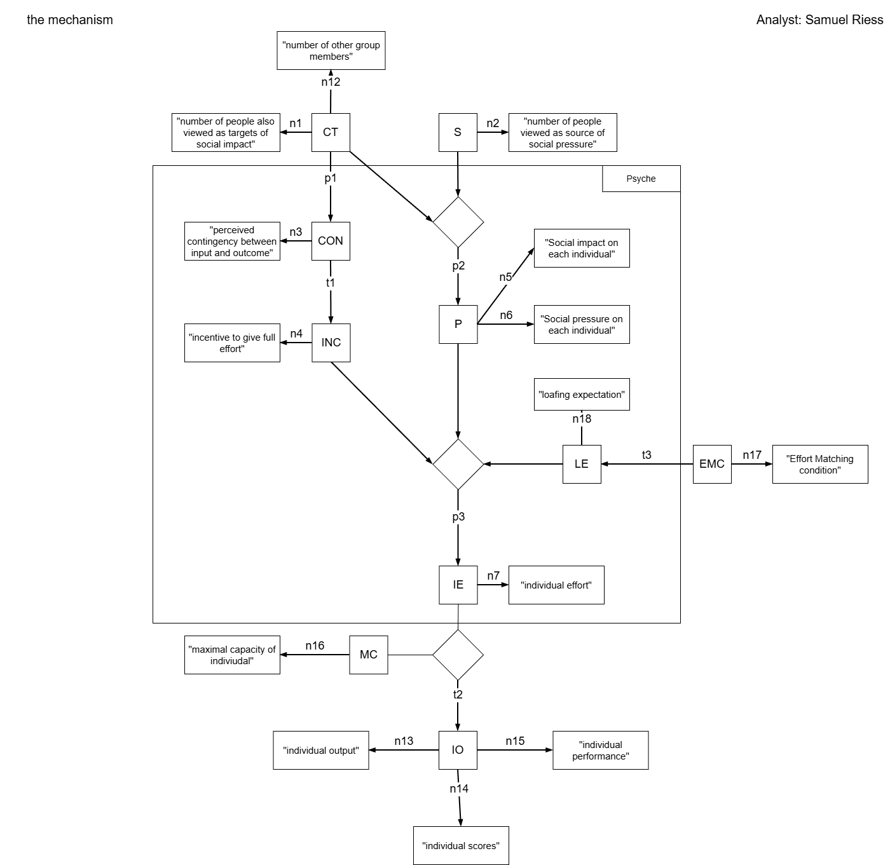

```{r setup}
#| echo: false 
#| include: false 

# loading of the necessary packages 
library(papaja) # for an automatically outut of results, p.e. apa_print()
library(flextable) # for displaying tables in APA-Style 
library(pwr) # for the power-Analysis 
library(ggplot2) # for the plotting and descriptives
library(dplyr) # for smoother functions
library(multcomp) # for the statistical analyses

#if we source a R-document, it runs in advance and we get all created objects from that file aswell for that document/report
source("simulation/01_base.R")
source("simulation/02_simulation.R")
```

# Introduction

# Objective

In this report, we formalize an existing psychological theory to test the relation between the emerging phenomena and the corresponding data by means of a computational model, based on the underlying theory. Following the methodological framework outlined by Borsdoom [@borsboom2021], we generate simulated data for a fictional experiment inspired by the original study in which the phenomenon was first described. We are mainly interested in replicating key empirical findings associated with the phenomenon and to demonstrate that the model is capable of reproducing the phenomenon across different hypothetical scenarios. The need for such work is grounded in broader concerns within psychological science, known under terms like "reproducibility crisis" (citation Borsboom). Hence, our aim is to take a closer look at the relationship between the underlying theory and the emerging phenomenon, evaluating how well the theoretical assumptions can account for the observed effects.

# Introduction of the theory

We chose a social psychology theory for that the emerged phenomena contains clearly observable variables, both input and output ones. The theory, named "social impact theory", was first mentioned in 1973, but the large framework with all supposed mechanisms and effects was published 8 years later [@latané1981]. Between these publications, Latané published "Many Hands Make Light The Work: The Causes and Consequences of Social Loafing" in which the term "social loafing" was first defined. There, they tried to explain it using the first approaches of social loafing theory. For adding more depth to the phenomenon we are referring to an extending mechanism, named "Effort Matching" [@jackson1985].

## Core constructs

Our formalization is grounded on some core constructs. These are orientated at citations we withdrawed directly from the existing research. Some constructs were specified differently over the whole report, so we aimed to label them in a way that serves a greater interpretation. Of course, these labels are our own understanding of the constructs, further reseachers could focus on other elements. Furthermore, the scope is strongly limited to the main social loafing research, we only differ if there's some special need or cause for it.

All constructs and their sources can be seen in (Table 1), our VAST model contains them in a connected and graphic way to understand the underlying mechanism of the phenomenon. As one can see, the intial constructs that cause the effect are the Co-Targets and Sources of social impact, which are standing for group members and e.g. experimenters who supervise an experiment. The Effort matching condition (EMC) itself presents 3 experimental conditions: High effort, no information and low Effort. This construct isn't mentioned in @latané1979 and was therefore an extention

## Identification of the relevant Phenomena

In [@latané1979], the social loafing is described as followed: "People exhibit a sizeable decrease in individual effort when performing in groups as compared to when they perform alone". The Effort Matching mechanism is defined in another reasearch, stating: "they will maintain equity by matching the effort levels they expect from their partners" [@jackson1985]. This was already discussed before [@latané1979] but further investigated in the newer report.

To create a link between this phenomenon and our formalization of the social impact theory, we used our visual tool again. The resulting phenomenon itself can be seen in @fig-vast.

{#fig-vast fig-align="center" width="80%"}

To address the robustness of social loafing and therefore the good reason for investigating it further, we part it into two sections: Strength of evidence and Generalizability, using the UTOS framework (citation cronbach&Shapiro). We get our overview for both sections mentioned in this article by analyzing the Meta-Analysis about social loafing by [@karau1993]. We found phrases like "Both laboratory experiments and field studies have been conducted using a range of subject populations varying in age, gender, and culuture". This leads to the assumption that at least the setting (S) and the Units (U) were varied over the years, for the meta-analysis conducts about ... . Others phrases like "Several studies provided data for more than one relevant dependent variable" are leading towards a given generalizability for the dimension of Outcomes (O). At last, we found evidence The strength of evidence can be acknowledged cause the effect sizes are estimated using mean effect sizes that "differed significantly from the 0.00 value that indicates exactly no difference". In the end, the phenomenon can be considered robust because the whole UTOS framework and the strength of evidence are supported with empirical data.

# Method

## used software

Throughout our formalization, we use the Visual Argument Structure Tool (VAST, [@leising2023]) to build a graphic visualization of the theory and resulting mechanisms. With this methodology, we are able to define relationships, out understanding of core constructs and the mechanisms that take place in the process of social loafing and effort matching. For the computation of our simulated Data, we used R(hier Versionsnummer einfügen). Our graphic representation of the formalized theory was enabled throughout the application draw.io in which we created our VAST model.

## Formalization of the (Proto-)Theory

We used the VAST (Visual Argument Structure Tool) as a graphic form of formalization for our theory. Further information about the VAST and its application can be found in @leising2023. In the process, it was crucial to limit our scope, referring to both theory and phenomena. The main goal should be understandability, not the whole integrity of the full theory. The resulting prototype theory which ought to explain the phenomenon is presented in (@fig-mechanism). The "relationships" section shows each relationship and its justification, based on citations (labeled with a "c" in TabelleRelationship) or our own assumptions or restrictions. In keeping this section short, I am mixing up the explanation of the theory and justification of the described relationships.

{#fig-mechanism fig-align="center" width="100%"}

### Relationships

The relationship between the Co-Targets, Sources and the Pressure on the subject is presented in @fig-p2. We aimed to write a function that is consistent with exact citations from the sources. Originally, the pressure can be lowered throughout the number of Co-Targets and Sources simultaneously. As we can see in the Graphs, the higher the Number of Sources is, the higher gets the felt impact on one subject. This represents the classic increase which is mentioned in c4. But with an increase of the number of Co-Targets, the impact lowered rapidly. Therefore, consistent with the general interpretation of social impact theory, felt impact is divided up among the group members (c5-c8).

```{r}
#| label: fig-p2
#| fig-cap: "Plot for the relationsship p2"
#| echo: false
#| warning: false

plot_p2
```

The left path of our VAST (@fig-mechanism) is our main mechanism which produces the phenomenon in the end. It starts with the relationship between Co-Targets and the contingency which was rather intuitive, due to the specific function derived from the core report, verified with [@latané1979] and specifically in c1-c3. It is presented in @fig-p1.

```{r}
#| label: fig-p1
#| fig-cap: "Plot for the relationsship p1"
#| echo: false
#| warning: false

plot_p1
```

After that, the transformation for the Incentive can be represented by a proportional increase: Incentive gets the same values as the previously computed contingency (@fig-t1). This was not based on a focal theory, but we deviated that an incentive to give one's own full effort directly results from the depicted contingency, also proved with c14.

```{r}
#| label: fig-t1
#| fig-cap: "Plot for the transformation t1"
#| echo: false
#| warning: false

plot_t1
```

Things were getting more interesting with the function that computes the resulting individual effort, using all previously computed and simulated input variables. Both paths of our own VAST meet together in this relationship. The plot can be viewed in @fig-p3, showing the first influence of our effort Matching condition aswell. I wrote a function which transforms the manifest effort-matching condition (EMC) into the latent construct of a loafing expectation (LE), named t3and supported by c12/c13. If the subject takes action in the LE (low effort) or HE (high effort) condition, effort matching takes place and fixes individual effort to a previously fixed value for each condition. These two values for effort matching conditions can be chosen individually, but we made sure that its higher in the HE condition compared to the LE one. The blue graph shows the natural social loafing mechanism for the individual effort, based on no information whatsoever about the others effort. First, if the pressure is high, the function starts higher cause the subject feels more bound to the outcome. Secondly, with more incentive to give full effort the subject is getting higher values in the effort. We argue that, besides great pressure, the effort won't reach its maximum if the incentive to give full effort isn't maximized. The basic idea of the relationship is supported by c9-c11. We had to adjust the function to fit in our theory and model so P and IE had a range from 0-1.

```{r}
#| label: fig-p3
#| fig-cap: "Plot for the relationship p3"
#| echo: false
#| warning: false

plot_p3
```

The last isolated relationship we have to show is the transformation of IE and MC into the individual Outcome (IO). As can be seen in @fig-t2, the more maximum capacity each subject has, the higher the value for the outcome is. That occurs because we defined IE as a percentage of 1 (e.g. 0.6 = 60%) which is offset against the maximum. Hence, with more effort, the outcome is increasing simultaneously. We concluded a interaction effect between MC and IE that accounts for the final value of one's own output. The transformation function was needed to compute the manifest outcome for each person (e.g. in c15) and the group means for our statistical analysis later on.

```{r}
#| label: fig-t2
#| fig-cap: "Plot for the relationship t2"
#| echo: false
#| warning: false

plot_t2
```

### Variables

The variables for each of our constructs, if shown in our VAST, can be seen in (Tabelle einfügen).

## Evaluation of the formal model

Finally, we got to test our model with our simulation. We simulated the original experiment for social loafing, using the sound pressure as the individual outcome [@latane1979] but added the EMC predictor, known in our theory by "Effort matching condition". With a sample size of n=36 (view [@latane1979], we were able to test for the original effect and the effort matching mechanism in one sample). The descriptives for both analyses are showcased in @fig-box1 and @fig-box2.
These are highly influenced by the noise term of p3 and can be adjusted freely. We chose the parameters mean = 0 and sdd = 0.3 for our "noise term" of that function, cause we assume that variability comes into the model throughout many sources: e.g. fatigue, personality, or the current mental state.

```{r}
#| label: fig-box1
#| fig-cap: "Boxplot for the replication of Latané"
#| echo: false
#| warning: false

boxplot_latane
```

```{r}
#| label: fig-box2
#| fig-cap: "Boxplot for the replication of Jackson & Harkins"
#| echo: false
#| warning: false

boxplot_harkins
```

```{r}
#prepare the ANOVA of Latané for the final result part
latane_anova <- apa_print(fit_aov)
```

It turns out that both effects, on one side the social loafing but on the other the elimination of this phenomenon throughout implementing a low and high Effort condition was successful. The packed result can be viewed in @fig-final. Only in the SLR-condition, we detected a significant decrease in the outcome between the group and alone situation (p `r printp(p_slr)`). For the low effort condition the difference was no longer significant with p=`r printp(p_low)`, same for the high effort condition with p=`r printp(p_high)`. Therefore, we've shown that Effort Matching is produced via our model. For our main replication, the number of Co-Targets had a significant effect on the individual sound output `r latane_anova$full_result$CT_factor`. This is consistent with the findings of [@latané1979] and proves that our model is capable of producing the main effect: a decrease in individual and group outcome throughout an increase of Co-Targets.

```{r}
#| label: fig-final
#| fig-cap: "Final plot of the simulation"
#| echo: false
#| warning: false

plot_final
```

# Meta-reflection

Some issues need to be discussed at the end. First, they original paper contained many jangle-fallacies, so it was quite difficult to form some definitions for our main construct. E.g, the "outcome" was often labeled as "performance" and hard to differ from definitions like "effort". Second, it was a challenge to implement the sources into our model, cause there were mentioned but not directly manipulated in the experiments [@latané1979]. The social loafing theory itself (view @latané1981)has some issues too: Both Co-Targets and Sources flow in the creation of social impact, but there's no specification of the augry and how it can be computed - we had to make a few more assumptions and set the augy to positive. A good limitation of the scope is absolutely necessary when formalizing this theory while Using VAST cause there are some inconsitencies that need to be eliminated with that procedure

# References

# Appendix
